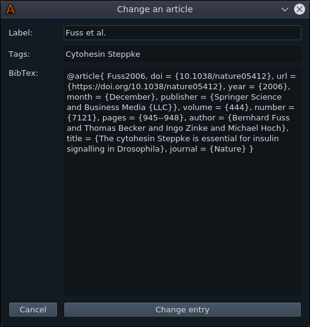

## Scientific Article Tracker


---

### Basic idea:

Create an easy to use drag and drop application that keeps track of your articles. Articles should be easy to retrieve using a system that enables the user to tag articles with 1-10 words. The project is focussed on simplicity by providing a small GUI that can be interacted with by ether clicking it and opening a search menu or draging an article on it to save it. Another feature is that the articles are saved with their BibTex citations and this way the user can easily retrieve them when they want to write a protocol/paper using latex.

---

### Functions:

* Save articles with one drag and drop action
* Add tags to your documents to make them easier to find 
* Retrieve the BibTex citation of your article
* Open articles with a double click
* Write the BibTex citation of selected articles to a .bib file

---

## User guide


#### 0. Installation

Install required python libraries:

```python
# pip install -r requirements.txt
```

Run the program:

```python
# python citation_tool.py
```

Close the program with the close all windows action (Standard shortcut -> Alt + Escape)

---

#### 1. General


When the program is run, this interface should be located in the top right corner of your screen. The number in the
window is the number of articles you added to the system. The look of this window can be changed in the settings.
There two ways to interact with the window:

1. Add an article by dragging and dropping the PDF onto the GUI

2. Click on the window to open the Main interaction Point

---

#### 2. Adding articles


Articles can be added by drag and dropping the PDF document onto the small window on the right corner of your screen.
This will open a second window, that has the job to collect information about the article you want to add.


Information that is required to add an article:

1. Name: Give your article a name that is as descriptive as possible
2. Tags: Tag your article with 3-4 words to make a search as easy as possible.
3. DOI or BibTex: Articles can be added ether with a DOI or a BibTex citation. (If you add a DOI the BibTex will be
generated automatically)
4. Move file: The application creates a hidden folder in your home directory and if you check the move file mark your
articles will be moved to the folder and renamed with their index and title.

Adding an article with its BibTex citation


Adding an article with its DOI


 

---

#### 3. Main Interaction Point


The primary goal of the main interaction point is to display your articles and lets you query them with a search
function. Further, you can open the article PDFs by double clicking the article in the list. When you open an article,
its relevance score will increase, resulting in a ranking based on how much you opened/used the articles when you sort 
the articles for relevance.

Notes can be added to your article in form of a text document that is linked to the article. It can be opened directly
from the Main interaction point (Standard shortcut -> Ctrl+n)

The article folder containing all articles and the notes folder containing a collection of all notes can be opened via
the menu. 

---

#### 4. Change article information



Changing an articles information can be achieved by opening the article change window over the menu (Standard shortcut
-> Ctrl+d). 

---
#### 5. Exporting citations

The first way to export your articles/citations is to use the shortcut for quick copy, which will copy the BibTex of
your selected article to your clipboard. (Standard shortcut -> Ctrl+c) This makes adding individual articles to your
 paper/protocol easy.

If you plan to export multiple article citations I advice you to use the export window. Open the window using articles
-> Open Export or use the shortcut (Standard shortcut -> Ctrl+e)


Use the provided shortcut or press the right arrow button to add your selected article or articles to the export window
(Standard shortcut -> Ctrl+x). Remove articles with the left arrow. When you are happy with your selection, use the 
Copy button to copy all citations to your clipboard or create a BibTex file (.bib) with the Export to BibTex button.

---
#### 6. Settings

Customize your window sizes, their looks and the shortcuts using the settings window (Standard shortcut -> Ctrl+q).
You can also change your standard note format between Markdown and plain text.


---
